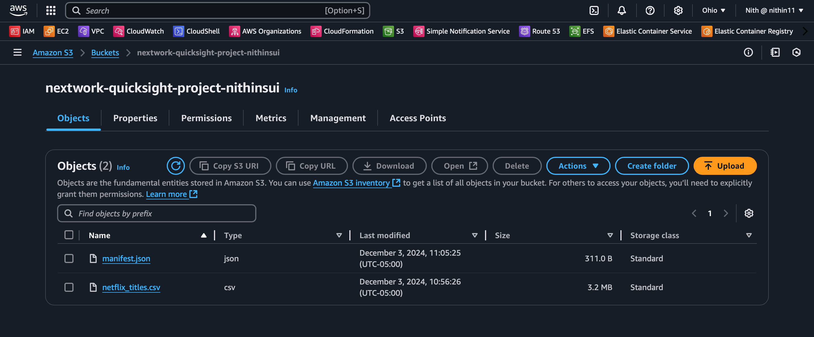
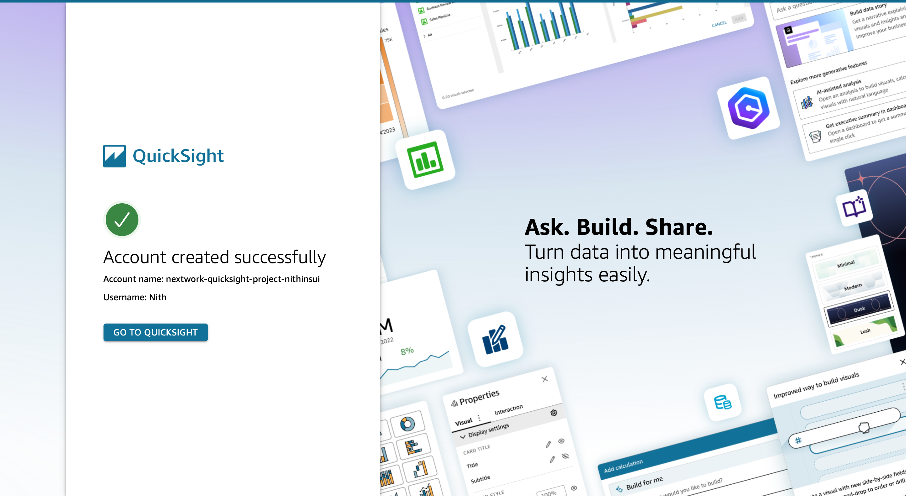
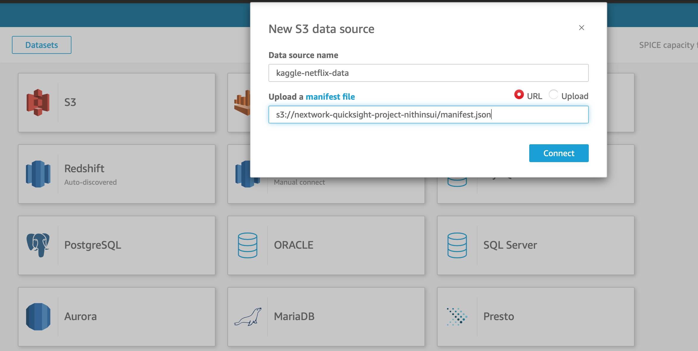
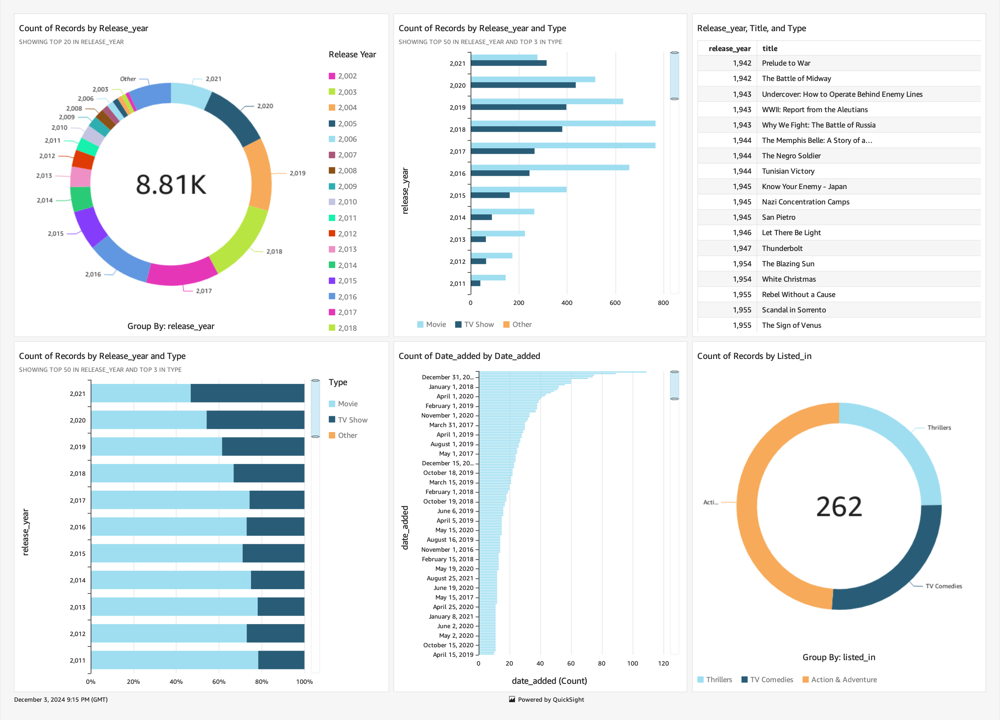

AWS Project 2 - Data Visualisation using Amazon Quicksite

In this project, we will demonstrate how to utilize Amazon S3 for storing and organizing data and Amazon QuickSight for creating interactive data visualizations and dashboards. The process involves creating an S3 bucket, uploading data, configuring bucket policies, and using QuickSight to connect to the S3 data and generate insightful visualizations.

Introduction to S3

Amazon Simple Storage Service (Amazon S3) is a scalable object storage service that provides secure, durable, and highly available storage for a wide range of data types. It allows you to store and retrieve any amount of data at any time, making it ideal for a variety of use cases including backup and restore, data archiving, and content distribution.

Introduction to QuickSight

Amazon QuickSight is a fast, cloud-powered business intelligence service that makes it easy to create and publish interactive dashboards. It allows you to connect to various data sources, perform ad-hoc analysis, and share insights with your organization, all while leveraging the scalability and flexibility of AWS.

Steps Overview

1) Create an S3 Bucket:

Log in to your AWS Account and open the S3 console.
Create a new bucket named netflix-quicksight-project-nithin. Select the region closest to you and keep the rest of the settings as default.
Upload the dataset files (netflix_titles.csv and manifest.json) to the bucket.
Copy the S3 URL of your netflix_titles.csv file.
Edit the manifest.json file to replace the placeholder URL with your S3 URL.
Re-upload the edited manifest.json file to the bucket.

2)Configure Bucket Settings: 
Adjust the settings for your S3 bucket to enhance security and management, including enabling versioning and server access logging.
Upload Data: Organize and upload your data into the S3 bucket. Use folders to maintain a logical structure and set object metadata for better data management.

3)Set Bucket Policies: 
Define bucket policies to control access permissions. This includes setting up IAM policies and configuring public access settings where necessary.

4)Connect QuickSight to S3: 
Link your Amazon QuickSight account to the S3 bucket to access the stored data. This involves setting up data sources within QuickSight.

5)Create Visualizations: 
Use QuickSight to create interactive visualizations from your data. Choose appropriate chart types and configure them to effectively present your data insights.

 
 

6)Build Dashboards: 
Combine multiple visualizations into comprehensive dashboards in QuickSight. Apply filters and drill-down options to enhance data interaction.

7)Share Dashboards: 
Share your QuickSight dashboards with other users, assigning appropriate access permissions to ensure secure and controlled data sharing.

Extras:

Bucket Settings:

Why is it important to configure versioning for your bucket?

Configuring versioning for your bucket is important because it allows you to keep multiple versions of an object in one bucket. This helps protect against accidental overwrites and deletions, and makes it easier to recover previous versions of objects if necessary.
How does enabling server access logging help in monitoring?
Answer: Enabling server access logging helps monitor the requests made to your bucket. It records details about each request, such as the requester, bucket name, request time, request action, and response status, which is useful for security and troubleshooting.
Data Upload:

Why is it essential to organize your data into folders in S3?

Organizing data into folders in S3 is essential because it improves data management and makes it easier to navigate and find specific files. This logical structure helps in maintaining a clean and efficient data repository.
What benefits do you get from setting object metadata during the upload?
Answer: Setting object metadata during the upload provides additional information about the object, which can be used for various purposes such as cache control, content type identification, and custom tags for better data management and retrieval.
Bucket Policies:

How do bucket policies differ from IAM policies?

Bucket policies are resource-based policies that are attached directly to an S3 bucket and define permissions for that bucket. IAM policies, on the other hand, are attached to IAM identities (users, groups, roles) and define what actions those identities can perform on AWS resources. Bucket policies are specific to S3, while IAM policies can be used for any AWS service.
What is the significance of granting public read access to a bucket?
Answer: Granting public read access to a bucket makes all the objects in that bucket accessible to anyone on the internet. This is significant for use cases such as hosting static websites, where the content needs to be publicly accessible. However, it must be done with caution to avoid exposing sensitive data.
Creating Visualizations in QuickSight:

What types of data sources can QuickSight connect to?

Answer: QuickSight can connect to a variety of data sources including S3, RDS, Redshift, Athena, various databases (MySQL, PostgreSQL, SQL Server), and third-party services such as Salesforce.
How does QuickSight ensure the data is up-to-date in visualizations?
Answer: QuickSight ensures data is up-to-date in visualizations by allowing scheduled data refreshes. You can set up refresh schedules to automatically update the data at specified intervals, ensuring that the visualizations reflect the most current data.
Creating Dashboards:

What are the benefits of using dashboards in QuickSight?

Dashboards in QuickSight provide a comprehensive and interactive way to view and analyze data. They allow users to combine multiple visualizations into a single view, apply filters, and drill down into specific details, enhancing data insights and decision-making.

How can you share dashboards with other users?

Dashboards in QuickSight can be shared with other users by granting them access permissions. You can share dashboards with specific users or groups, allowing them to view or edit the dashboards based on the permissions you assign.
