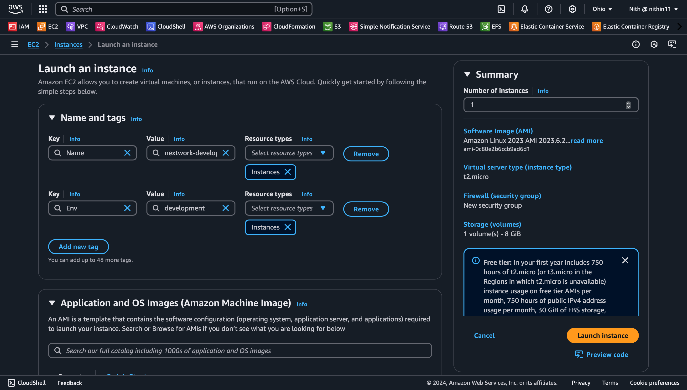

Cloud Security with AWS IAM 

In this project, we are setting up a secure and efficient AWS environment for NextWork, focusing on the development and management of AWS resources. The goal is to onboard an intern, giving them controlled access to a development EC2 instance while ensuring they don’t interfere with the production environment. We will use AWS services like EC2 for hosting instances and IAM (Identity and Access Management) for managing user permissions and access control.

AWS Services Used:

EC2 (Elastic Compute Cloud):
EC2 provides scalable computing capacity in the cloud. In this project, we deploy two EC2 instances—one for the production environment and one for development. The intern will be granted access only to the development instance to ensure that their actions don't impact the production environment.

IAM (Identity and Access Management):
IAM enables us to securely control access to AWS services and resources. Through IAM, we create policies, user groups, and users to manage permissions. This ensures that the intern can access only the development EC2 instance, with no access to the production instance, thus minimizing security risks.

Instructions:

Create an IAM Policy:

Begin by creating an IAM policy that specifies the intern’s access to the development EC2 instance, while restricting access to the production EC2 instance.
This policy will allow the intern to perform actions such as starting, stopping, and describing the development instance.
Additionally, the policy will deny certain actions, such as creating or deleting tags, to prevent the intern from making unauthorized changes.

  

Create an AWS Account Alias:

To facilitate a more user-friendly experience, create an AWS account alias.
The alias replaces the default account ID-based login URL with a more memorable URL, such as nextwork-alias-yourname, making it easier for the intern to access the AWS Management Console.
This alias will help avoid the need for sharing long and complex account IDs.

  

Create IAM User Groups and Users:

Create a dedicated IAM user group named "nextwork-dev-group" and associate it with the IAM policy that grants access to the development environment.
This user group allows easy permission management for any future interns by grouping them together under the same set of permissions.
Next, create a new IAM user for the intern, naming it nextwork-dev-yourname, and assign this user to the previously created user group, ensuring they inherit the appropriate permissions for accessing the development instance.

  

Test the Intern’s Access:

After setting up the intern’s IAM user and permissions, log in using the intern’s credentials.
Test access by attempting to access both the development and production EC2 instances.
Ensure that the intern can only access the development instance and cannot interact with the production environment. This helps verify that the policy restrictions are correctly enforced.

  

Verify Access Restrictions:

Finally, perform tests to confirm that the intern cannot perform actions outside of their assigned permissions.
Attempt to stop the production instance. The intern should not have permission to stop the production instance, and an Access Denied message should appear.
Next, try to stop the development instance. The intern should successfully be able to stop it, confirming that they have the correct permissions for the development environment while being restricted from making changes to production resources.

  

