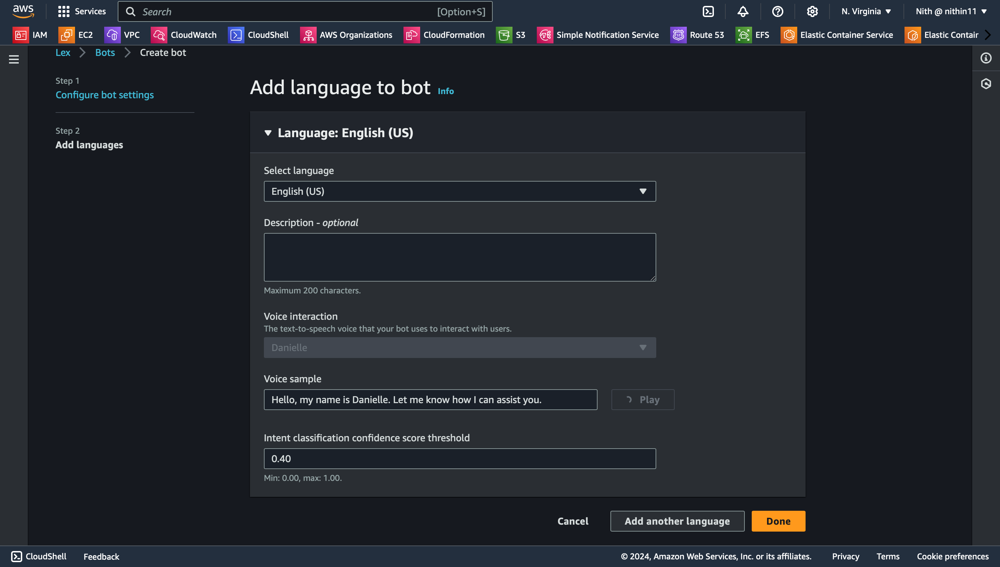

Developing BankerBot: A Practical Chatbot Using AWS Lex and Lambda

Project Abstract
This project is part of the "AI x AWS" series and focuses on developing a practical chatbot named BankerBot. BankerBot is designed to help customers of an imaginary bank check their account balance and transfer money between accounts. The project leverages AWS services, particularly Amazon Lex and AWS Lambda, to create a scalable and efficient chatbot. This report outlines the steps involved in setting up the chatbot, configuring intents and slots, and integrating with AWS Lambda for enhanced functionality.

Introduction to AWS Lex and Lambda

Amazon Lex
Amazon Lex is a service for building conversational interfaces into any application using voice and text. With Lex, you can quickly and easily create sophisticated, natural language, conversational bots. Lex provides the deep learning functionalities of automatic speech recognition (ASR) for converting speech to text, and natural language understanding (NLU) to recognize the intent of the text, enabling you to build applications with highly engaging user experiences and lifelike conversational interactions.

AWS Lambda
AWS Lambda is a compute service that lets you run code without provisioning or managing servers. Lambda executes your code only when needed and scales automatically, from a few requests per day to thousands per second. You can use Lambda to extend other AWS services with custom logic, or create your own backend services that operate at AWS scale, performance, and security.

Creating the Initial BankerBot Setup
1. Set up a new Lex chatbot:
    * Log in to your AWS Account.
    * Navigate to Amazon Lex (type Lex into your console's search bar).
    * Check your URL to ensure it says "...console.aws.amazon.com/lexv2/...". If not, switch to the Lex V2 console.
    * Select Create bot.
    * Choose Create a blank bot.
    * Enter the following details:
        * Bot name: BankerBot
        * Description: Banker Bot to help customers check their balance and make transfers.
        * IAM permissions: Create a role with basic Amazon Lex permissions.
        * COPPA: Select No.
        * Idle session timeout: Keep the default of 5 minutes.
    * Select Next and then Done.

  
   
2. Customize the WelcomeIntent:
    * Under Intent details, name it WelcomeIntent and add a description.
    * Add sample utterances such as "Hi", "Hello", "Good morning".
    * Scroll down to Closing response and enter the message:
        * "Hi! I'm BB, the Banking Bot. How can I help you today?"
    * Save and build the intent.
3. Customize the FallbackIntent:
    * Navigate to FallbackIntent.
    * Replace the default message with:
        * "Sorry, I am having trouble understanding. Can you describe what you'd like to do in a few words? I can help you find your account balance, transfer funds, and make a payment."
    * Save and build the intent.
4. Create the accountType Custom Slot:
    * Choose Slot types from the navigation panel.
    * Add a new slot type named accountType.
    * Enter the values: Checking, Savings, Credit, and add synonyms for Credit (e.g., credit card, visa, mastercard).
    * Save the slot type.
5. Create the CheckBalance Intent:
    * Add a new intent named CheckBalance with the description "Intent to check the balance in the specified account type."
    * Add sample utterances like "What's my balance?".
    * Add slots:
        * accountType: Prompt - "For which account would you like your balance?"
        * dateOfBirth: Prompt - "For verification purposes, what is your date of birth?"
    * Save and build the intent.
6. Connect AWS Lambda with Amazon Lex:
    * Create a Lambda function named BankingBotEnglish using Python 3.12.
    * Copy and deploy the provided source code.
    * In Lex, associate this Lambda function with your CheckBalance intent.
    * Enable the Lambda fulfillment for the intent and save.
7. Implement Context Carryover:
    * Create an output context in the CheckBalance intent named contextCheckBalance with a timeout of 5 turns or 90 seconds.
    * Create a new intent FollowupCheckBalance using the context tag to carry over the dateOfBirth slot value.
    * Connect the Lambda function to the FollowupCheckBalance intent and enable fulfillment.

Creating the TransferFunds Intent and Exploring Amazon Lex Features
1. Create the TransferFunds Intent:
    * Add a new intent named TransferFunds with the description "Help user transfer funds between bank accounts."
    * Add slots:
        * sourceAccountType: Prompt - "Which account would you like to transfer from?"
        * targetAccountType: Prompt - "Which account are you transferring to?"
        * transferAmount: Prompt - "How much money would you like to transfer?"
    * Add confirmation prompts:
        * Confirmation prompt: "Got it. So we are transferring {transferAmount} from {sourceAccountType} to {targetAccountType}. Can I go ahead with the transfer?"
        * Decline response: "The transfer has been cancelled."
        * Closing response: "The transfer is complete. {transferAmount} should now be available in your {targetAccountType} account."
    * Save and build the intent.
2. Explore Cool Features in Amazon Lex:
    * Conversation Flow:
        * At the top of the TransferFunds intent page, expand the Conversation flow panel to see an example conversation flow.
    * Visual Builder:
        * Select the Visual builder button at the bottom bar of your screen to see a visual representation of the intent you have just built.

